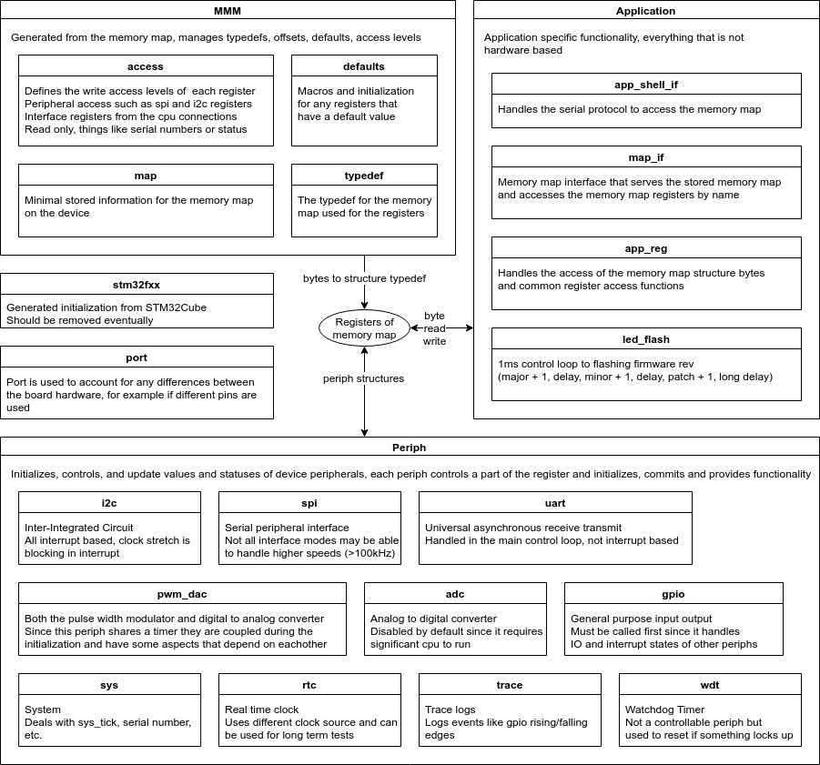

## PHiLIP Firmware Design
PHiLIP firmware is designed to easily add peripheral functionality.
It separates out the peripherals from the communication and application logic and the memory map.
More information on firmware design is available in the [doxygen docs](https://mrkevinweiss.github.io/philip/doxygen/index.html)

## PHiLIP Serial Protocol
The communication medium for PHiLIP is a serial connection.It provides basic instructions that allows for extensibility from other interfaces or basic communication.
Replies are given in standard json format with a `"result"` that corresponds to a `errno` code and `"data"` if data is present.
For example reading bytes from a register would respond with `{"data":[0,1,2,3,4,5,6,7,8,9], "result":0}`

Name           | Command                        | Description                                          | Example             | Example Description
---------------|--------------------------------|------------------------------------------------------|---------------------|------------------------------------------------------------------------------
READ_REG_CMD   | `rr <index> <size_of_bytes>`   | Read application registers                           | `rr 0 10`           | Reads 10 bytes starting at register 0
WRITE_REG_CMD  | `wr <index> [data0 ... datan]` | Write application registers                          | `wr 10 99 88 77`    | Writes 99, 88 and 77 starting at register 10
EXECUTE_CMD    | `ex`                           | Execute and commit changes in the registers          |                     |
RESET_CMD      | `mcu_rst`                      | Provide a software reset to PHiLIP                   |                     |
VERSION_CMD    | `-v`                           | Prints the version of the interface                  |                     |
HELP_CMD       | `help`                         | Prints a help menu                                   |                     |
MEMORY_MAP_CMD | `mm <record_index>`            | Gives properties of the memory map for a given index | `mm 0`              | Gives the properties of the first entry of the memory map
MM_SIZE_CMD    | `mm_size`                      | Gives the amount of records in the memory map        |                     |
READ_KEY_CMD   | `r <reg_name> [array_index]`   | Reads values given a record name                     | `r user_reg 2`      | Reads the 3rd value of the user_reg
WRITE_KEY_CMD  | `w <reg_name> <data>`          | Writes a value to a record name                      | `w i2c.mode.init 0` | Writes 0 to the i2c mode bit causing it to reinitialize the next `ex` command

## Building Firmware from Sources
PHiLIP was developed in the EclipseIDE but can be build with make.  To build simple call `BOARD=BLUEPILL make` or `BOARD=NUCLEOF103RB make` in the FW directory.

## Build Requirements
The following are the conditions to provide the build.

Application         | Version
--------------------|-----------------------------------------------------------------------------------------------------------------------------------------
EclipseIDE          | Neon.3 Release (4.6.3)
ST System Workbench | sw4stm32_linux_64bits-c2.4
OS                  | Ubuntu 16.04
Compiler            | gcc version 7.2.1 20170904 (release) [ARM/embedded-7-branch revision 255204] (GNU Tools for Arm Embedded Processors 7-2017-q4-major)
Assembler           | GNU assembler version 2.29.51 (arm-none-eabi) using BFD version (GNU Tools for Arm Embedded Processors 7-2017-q4-major) 2.29.51.20171128
Linker              | GNU ld (GNU Tools for Arm Embedded Processors 7-2017-q4-major) 2.29.51.20171128
memory-map-manager  | 0.0.9
STM32Cube V1.0      | 4.26.0
STM32Cube FW_F1     | V1.6.1
