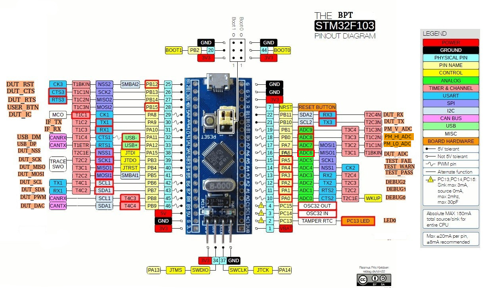

# Testing
This is intended to provide tools for embedded testing.

# Setting up the BPT (bluepill tester)

## Tools
- SWD or JTAG flasher
- Soldering iron and solder

## Materials
- [bluepill](https://hackaday.com/2017/03/30/the-2-32-bit-arduino-with-debugging/) or [nucelo-f103rb](https://www.digikey.com/products/en?keywords=nucleo-f103rb)

## Flashing bluepill
1. Solder pins on the bluepill and secure the USB connector of not already done.
2. Download [firmware](QUALIFIED_FW) from the QUALIFIED_FW folder.
3. Flash using an [SWD or JTAG interface](https://satoshinm.github.io/blog/171212_stm32_blue_pill_arm_development_board_first_look_bare_metal_programming.html).  (I usually like using the Nucleo debugger/flasher since it is cheap, has USB to Serial and support drag and drop binary).
4. If custom implementation is desired open source firmware is available in the [PHiLIP](FW/) folder.

## Flashing nucleo-f103rb
1. Download PHiLIP-nucleo103rb* [firmware](QUALIFIED_FW) from the QUALIFIED_FW folder.
2. Drag and drop the .bin file to flash

# Using the bluepill
## Tools
- USB to UART converter

## Materials
- PHiLIP with qualified firmware
- breadboard
- DUT (device under test)
- Jumper wires

## Running Test
(examples will use periph_i2c test)
1. Connect DUT to the testing computer.
2. Connect the BPT to the USB to UART converter.  
(IF_RX of BPT <-> TX of USB to UART)  
(IF_TX of BPT <-> RX of USB to UART)
3. Connect specific pins required for testing the DUT to the BPT  
(DUT_SCL of BPT <-> SCL0 of DUT)  
(DUT_SDA of BPT <-> SDA0 of DUT)
4. Flash DUT with test firmware
5. Run python script in the test folder

# bluepill Pinout

# nucleo-f103rb Pinout

# PHiLIP Misc Info
- I2C slave address is 85 or 0x55
- Total registers are 256
- Upper registers can be read or written (152+)
- sys register is locked
- For changing configuration the registers can be set then the ex command must be used to execute changes
