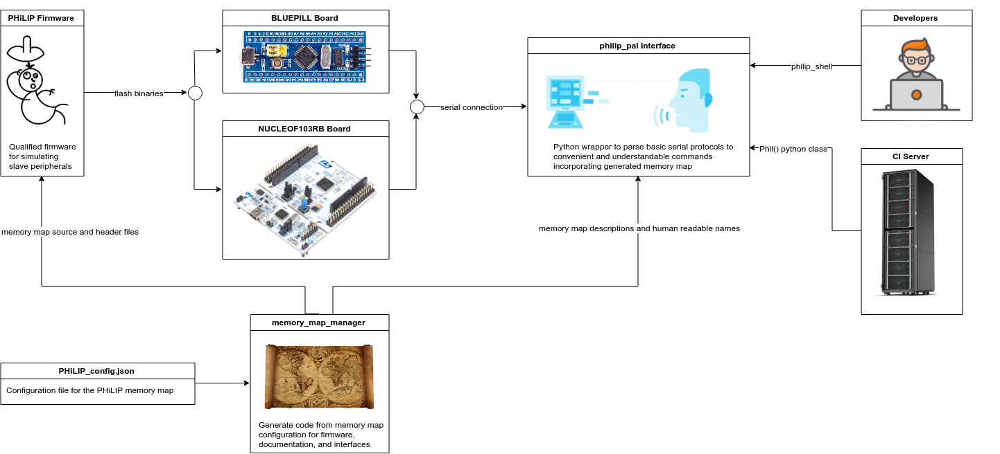
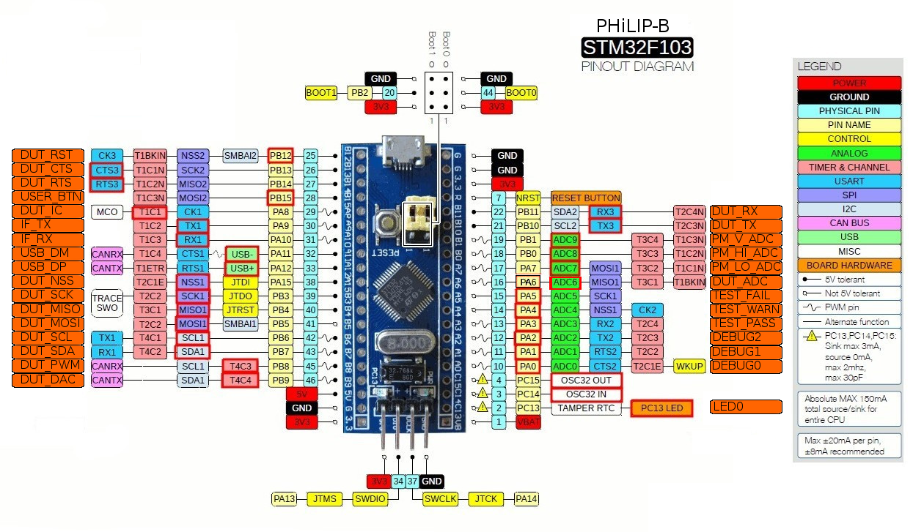
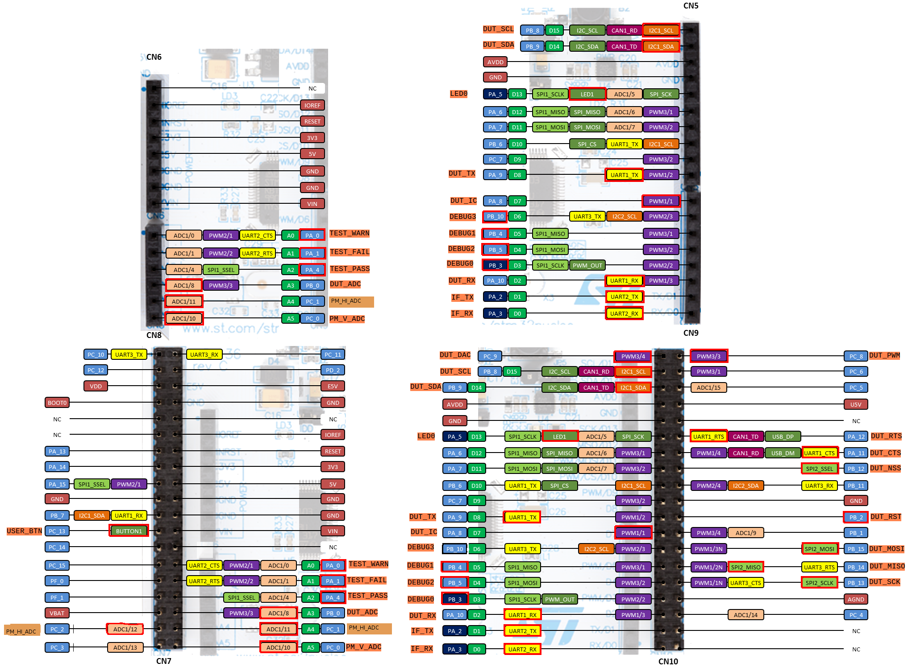

PHiLIP (Primitive Hardware In the Loop Integration Product)
===========================================================
[](https://travis-ci.org/riot-appstore/PHiLIP)


## Contents
<a name="c_desc"></a>
- [ Description ](#desc)
<a name="c_setup"></a>
- [ Setup of PHiLIP Environment ](#setup)
<a name="c_gs_dev"></a>
- [ Getting Started as a Developer ](#gs_dev)
<a name="c_gs_ci"></a>
- [ Getting Started with CI Scripts ](#gs_ci)
<a name="c_arch"></a>
- [ PHiLIP Infrastructure ](#arch)
<a name="c_pinb"></a>
- [ PHiLIP-b Pinout ](#pinb)
<a name="c_pinn"></a>
- [ PHiLIP-n Pinout ](#pinn)
<a name="c_pind"></a>
- [ Pin Descriptions ](#pind)
<a name="c_testc"></a>
- [ Test Capabilities ](#testc)
<a name="c_map"></a>
- [ PHiLIP Memory Map ](#map)
<a name="c_faq"></a>
- [ Design FAQs ](#faq)


## Links
- [PHiLIP Interface](IF/philip_pal)
- [PHiLIP Firmware Documentation](FW)
- [PHiLIP Firmware Doxygen Documentation](https://mrkevinweiss.github.io/philip/doxygen/index.html)
- [Qualification of PHiLIP](QUALIFICATION)

<a name="desc"></a>
## [Description](#c_desc)

PHiLIP is qualified open-source firmware for nucleo-f103rb or bluepill boards used for testing peripherals of other embedded devices.
PHiLIP is a low-cost solution to allow detailed, corner case peripheral testing for both developers and CI systems.
PHiLIP is aimed at getting salient information that would be gathered from an oscilloscope or logic analyzer as well as injecting specific peripheral behaviors.
PHiLIP is designed for testing peripheral APIs for embedded operating systems and hardware abstraction layers but was built with an architecture that allows for _easy_ extensions to other applications such as product qualification or simulation.
PHiLIP can be used with a raw serial connection but also comes with a python interface that simplifies writing test scripts as well as a shell for developers to run manual tests.

<a name="setup"></a>
## [Setup of PHiLIP Environment](#c_setup)
The setup will explain how to flash PHiLIP and install the python interface.
To setup the PHiLIP environment some hardware will be required, either a nucleo-f103rb or a bluepill with a usb to uart converter.

#### 1. Connect PHiLIP pins
For the nucleo-f103rb only the usb connection is required.
The bluepill will require a uart connection to `A9 - IF_TX` to the uart RX pin and the `A10 - IF_RX` to the uart TX pin.
See the [PHiLIP-b pinout](RESOURCES/PHiLIP-BLUEPILL-PINOUT.png) for more information.
The uart is needed for the basic interface but can also be used for ROM UART flashing.
To flash the bluepill with SWD, connect the swd pins and reset `R - NRST` pin.


#### 2. Flash PHiLIP to the device
The qualified firmware for PHiLIP is stored in the [PHiLIP Releases](https://github.com/riot-appstore/PHiLIP/releases).
The correct firmware is needed for the given board, either the [PHiLIP_BLUEPILL](https://github.com/riot-appstore/PHiLIP/releases/download/v1.0.2/PHiLIP-BLUEPILL.bin) or the [PHiLIP_NUCLEO-F103RB](https://github.com/riot-appstore/PHiLIP/releases/download/v1.0.2/PHiLIP-NUCLEO-F103RB.bin).
To flash the firmware on the nucleo-f103rb, drag and drop the .bin file to the nucleo device.
There are many ways to flash the bluepill, either by connecting a swd connector or with the [ROM UART bootloader](https://medium.com/@paramaggarwal/programming-an-stm32f103-board-using-usb-port-blue-pill-953cec0dbc86).
After flashing PHiLIP should be blinking the firmware revision pattern (_1 + the firmware number, so firmware revision 1.0.3 would blink 2, 1, 4 times_).

_HINT: If flashing a nucleo-f103rb with a ubuntu machine use the following command_

`wget -P /media/${USER}/NODE_F103RB/ https://github.com/riot-appstore/PHiLIP/releases/download/v1.0.2/PHiLIP-NUCLEO-F103RB.bin
`

#### 3. Install the Python Interface (philip_pal)
The philip_pal is only python3 so use the following command to install:

`sudo pip3 install philip_pal`

<a name="gs_dev"></a>
## [Getting Started as a Developer](#c_gs_dev)
_First follow the [setup](#setup)_

To use PHiLIP as a developer, an interface shell `philip_shell` is provided with the [philip_pal package](IF/philip_pal).
The philip_shell has a connect wizard, command history, and auto-completion.
If in doubt, try pressing tab a few times or typing in `help`.

The following is an example of PHiLIP running and evaluating a toggling pin.
This should show how to use the different functionalities of PHiLIP such as:
- Reading different parameters
- Setting configurations with a single command
- Prepared multiple configuration changes then executing

This should provide a way to get started using PHiLIP.
Run the philip shell with `philip_shell` _(use the -h to view additional args)_

#### 1. Exploring the philip_shell

1. Check available commands with `help`, this shows each of the commands.
For information of each of the commands type `help <topic>`
```
PHiLIP: help
Documented commands (type help <topic>):
========================================
data_filter      exit         info_record_type  read_reg     show_pinout      
dut_reset        get_version  philip_reset      read_struct  write_and_execute
execute_changes  help         print_map         read_trace   write_reg
```

1. Check the description of the memory map.
This should help explain what each register is responsible for.
The registers or memory map records are the primary way to configure and get data.
```
info_record_type description
```

1. Check the pinout of the philip.
This give an idea on where the connect pins on the board.
```
show_pinout
```

1. Connect the `DUT_RST` to the `DEBUG0` pin.
1. Check what the `gpio[0].mode.io_type` register does.
This shows the functionality of the register, in this case allowing us to set the type of GPIO pin mode.
```
print_map gpio[0].mode.io_type
```
1. Prepare the `DEBUG0` pin to be called from an interrupt with the `DUT_RST` pin connected.
Since the `DUT_RST` pin is open drain we must configure the `DEBUG0` pin to be a pullup.
```
write_reg gpio[0].mode.pull 1
```

1. Enable the `DEBUG0` or gpio0 pin to interrupt mode so traces can be collected.
Since traces can capture events from the interrupt we must enable the interrupt.
```
write_and_execute gpio[0].mode.io_type 3
```
1. Use the `DUT_RST` pin to toggle events on the `DEBUG0` pin.
By toggling the `DUT_RST` pin the trace events get logged.
```
dut_reset
```

1. Verify the events are logged in a human-readable way.
```
read_trace
```

1. Read the basic tick registers of the trace.
The is the basic register information without any processing.
Many register values can be interrogated in this way.
```
read_reg trace.tick
```

1. Only read the first two elements of the array.
This shows how read registers with arrays.
```
read_reg trace.tick 0 2
```

1. Now read the whole trace structure.
```
read_struct trace
```

1. Toggle the data filter off to see very verbose details of the tick traces
```
data_filter
read_struct trace
```

1. Now reset philip back to the default state.
```
data_filter on
philip_reset
```

1. Manually prepare the rtc time.
This shows how to prepare the data that must be executed at the same time.
```
write_reg rtc.set_minute 4
write_reg rtc.set_hour 14
write_reg rtc.set_day 100
```

1. Clear the rtc.mode.init bit to reinitialize and set rtc values on execute.
```
write_reg rtc.mode.init 0
```

1. Execute the changes.
The first checks to see if the module needs to be reinitialized then performs the initialization when executed.
```
execute_changes
```

1. Read the new RTC time and confirm changes propagated.
```
read_struct rtc
```

1. Notice that the second was reset to 0 because that is the default time.

#### 2. The Process of Updating the Runtime Configuration of PHiLIP

To actually change the PHiLIP configuration, a number of steps must occur:
1. Write the register intended to change
2. Set the module init bit to 0
3. Execute changes

or

use the `write_and_execute` command that does all of the listed steps.

This processed is used since multiple changes may need to be done at one time or the changes must be done in a specific order.
The `.mode.init` bit prevents reinitialization of other modules which reduces response time and prevents spurious IO changes when reinitializing.
The execution of changes (or commit changes) allows PHiLIP to only check changes once rather than have to check every time some information is written.

<a name="gs_ci"></a>
## [Getting Started with CI Scripts](#c_gs_ci)
_First follow the [setup](#setup)_

To use the python interface in a CI, a Phil class is provided.
Create a python script for the CI to run and import Phil to use.
Refer to the [philip_if.py](/IF/philip_pal/philip_pal/philip_if.py) for more information.

Example of python test script that tests the trace function.
_connect the `DUT_RST` to the `DEBUG0` pin._

```python
from philip_pal import Phil

phil = Phil()
print("interface version: {}".format(phil.if_version))

# Reset philip to a clean state
assert phil.reset_mcu()['result'] == phil.RESULT_SUCCESS

# Setup DEBUG0 pin to log trace events with interrupt
phil.write_and_execute('gpio[0].mode.pull', 1)
for result in phil.write_and_execute('gpio[0].mode.io_type', 3):
    # Check each result for success
    assert result['result'] == phil.RESULT_SUCCESS

# Toggle the DUT_RST pin for the default period
phil.dut_reset()

# Toggle the DUT_RST pin for 1 second
phil.dut_reset(1.0)

trace = phil.read_trace()['data']

# Assert the second toggle was in fact about 1 second
elapse_time = trace[3]['time'] - trace[2]['time']
assert elapse_time > 0.9 and elapse_time < 1.1

print("Trace Results")
print(trace)
```
<a name="arch"></a>
## [PHiLIP Infrastructure](#c_arch)
PHiLIP uses a combination of tools in order to work.
The [memory_map_manager](https://github.com/riot-appstore/memory_map_manager) or MMM help maintain and coordinate the memory map used for the firmware, documentation, and interface.
The [philip_pal](IF/philip_pal) wraps around the basic serial protocol so functionality can be implemented and handled with a higher level language and in a non-constrained environment.
The initial version used [STM32Cube](https://www.st.com/en/development-tools/stm32cubemx.html), however, the generator is being deprecated in this project due to lack of portability.


<a href="RESOURCES/PHiLIP_infrastructure.png">
    
</a>

For the API check the docstring of [philip_shell.py](IF/philip_pal/philip_pal/philip_shell.py) or [philip_if.py](IF/philip_pal/philip_pal/philip_if.py)

<a name="pinb"></a>
## [PHiLIP-b Pinout](#c_pinb)
Pinout for the PHiLIP on the [bluepill](https://hackaday.com/2017/03/30/the-2-32-bit-arduino-with-debugging/)

<a href="RESOURCES/PHiLIP-BLUEPILL-PINOUT.png">
    
</a>

<a name="pinn"></a>
## [PHiLIP-n Pinout](#c_pinn)
Pinout for the PHiLIP on the [nucleo-f103rb](https://www.digikey.com/products/en?keywords=nucleo-f103rb)

<a href="RESOURCES/PHiLIP-NUCLEOF103RB-PINOUT.png">
    
</a>

<a name="pind"></a>
## [Pin Descriptions](#c_pind)

Pin Name  | Description                                                                                            
----------|--------------------------------------------------------------------------------------------------------
DUT_RST   | Connects to the reset pin of the DUT, can put  it in a reset                                           
USER_BTN  | User button if a test requires manual interaction, the pin can also be automated but the RPi in the CI
TEST_FAIL | Goes high if a low level test failed                                                                   
TEST_WARN | Goes high if a low level test has a warning                                                            
TEST_PASS | Goes high if a low level test passed                                                                   
DEBUG0    | A GPIO debug pin                                                                                       
DEBUG1    | A GPIO debug pin                                                                                       
DEBUG2    | A GPIO debug pin                                                                                       
LED0      | Heartbeat connection PHiLIP LED                                                                        
PM_V_ADC  | Samples the voltage of the DUT (only when connected in external power mode)                            
PM_HI_ADC | Coarse, mA range of current measurement (only when connected in external power mode)                   
PM_LO_ADC | Fine, uA range of current measurement  (only when connected in external power mode)                    
DUT_IC    | Input capture pin, this is used for timing measurements from the DUT                                   
DUT_PWM   | Feeds a pwm signal to the DUT to confirm DUT receives correct timing                                   
DUT_ADC   | Used to measure any analog out signals of the DUT                                                      
DUT_RX    | The UART receive pin, connect to the DUT's TX pin                                                      
DUT_TX    | The UART receive pin, connect to the DUT's RX pin                                                      
DUT_RTS   | The UART Ready To Send pin, connect to the DUT's RTS pin                                               
DUT_CTS   | The UART Clear To Send pin, connect to the DUT's CTS pin                                               
DUT_NSS   | SPI Chip Select                                                                                        
DUT_SCK   | SPI Clock                                                                                              
DUT_MISO  | SPI Master In Slave Out                                                                                
DUT_MOSI  | SPI Master Out Slave In                                                                                
DUT_SCL   | I2C Clock                                                                                              
DUT_SDA   | I2C Data                                                                                               

<a name="testc"></a>
## [Test Capabilities](#c_testc)
Test should test that certain conditions pass (eg. i2c_read_bytes actually reads the correct bytes) and the expected failures occur (eg. reading from a wrong i2c address should return the proper error code and not return a success)
PHiLIP should allow the following tests to be implemented.
### SPI
#### Pass Cases
- write to dummy register
- read from dummy register
- ensure a mode change has occurred
- change to all 4 modes
- 8/16 bit frame
- speeds
- stress test
- send different dummy data

#### Failure Cases
- incorrect mode settings
- incorrect pin configs
- unsupported speeds
- frame errors

### I2C
#### Pass Cases
- check if slave present
- write register
- read register
- change slave address
- slave clock stretch
- slave data not ready
- speeds
- stress tests
- 10 bit and 7 bit addr
- 8/16 bit registers

#### Failure Cases
- unterminated session
- wrong slave address
- incorrect pin configs
- unsupported speeds
- no pullup resistor
- double acquire

### UART
#### Pass Cases
- basic comms
- modem support
- change baudrate
- parity
- stop bit
- stress rx
- echo data
- change data
- ack data

#### Failure Cases
- wrong baudrate
- wrong configs
- incorrect pin configs

### ADC
#### Pass Cases
- Linearity
- speeds

#### Failure Cases
- incorrect pin configs
- unsupported speeds

### PWM
#### Pass Cases
- change duty cycle
- change period
- min/max bounds
- disable/enable
- timing test

### DAC
#### Pass Cases
- linearity

### Timers
#### Pass Cases
- time output clock is correct

<a name="map"></a>
## [PHiLIP Memory Map](#c_map)
The memory map is a way to access a large amount of information in a compact way.
With the [memory_map_manager](https://github.com/riot-appstore/memory_map_manager), firmware, documentation, and interfaces are all coordinated with a single config file.
This makes changes easy to manage, for example, if a field for reporting if an i2c fails to ACK on data is needed, that field can be added to the config file.
After updating the map it can be accessed from the interface to the firmware.
The current versioned memory maps is available [here](IF/philip_pal/philip_pal/mem_map).

_Example of memory map_

| Name                            |     Description                                                                                                                                                                                               |
|---------------------------------|---------------------------------------------------------------------------------------------------------------------------------------------------------------------------------------------------------------|
| user_reg                        |     Writable registers for user testing - Starts at 0 and increases by 1 each register by default                                                                                                             |
| sys.sn                          |     Unique ID of the device                                                                                                                                                                                   |
| sys.fw_rev                      |     Firmware revision                                                                                                                                                                                         |
| sys.if_rev                      |     Interface revision - This corelates to the version of the memory map                                                                                                                                      |
| sys.tick                        |     Tick in ms - Updates with the sys tick register every few ms                                                                                                                                              |
| sys.build_time.second           |     The build time seconds                                                                                                                                                                                    |
| sys.build_time.minute           |     The build time minutes                                                                                                                                                                                    |
| sys.build_time.hour             |     The build time hours                                                                                                                                                                                      |
| sys.build_time.day_of_month     |     The build time day of month                                                                                                                                                                               |
| sys.build_time.day_of_week      |     Not used                                                                                                                                                                                                  |
| sys.build_time.month            |     The build time month                                                                                                                                                                                      |
| sys.build_time.year             |     The build time year (20XX)                                                                                                                                                                                |
| sys.build_time.res              |     Reserved bytes                                                                                                                                                                                            |
| sys.device_num                  |     The philip device designator - A constant number to identify philip firmware                                                                                                                              |
| sys.sys_clk                     |     The frequency of the system clock in Hz                                                                                                                                                                   |
| sys.status.update               |     1:register configuration requires exceution for changes - 0:nothing to update                                                                                                                             |
| sys.status.board                |     1:board is a bluepill - 0:board is a nucleo-f103rb                                                                                                                                                        |
| sys.mode.init                   |     0:periph will initialize on execute - 1:periph initialized                                                                                                                                                |
| sys.mode.dut_rst                |     1:put DUT in reset mode - 0:run DUT                                                                                                                                                                       |
| i2c.mode.init                   |     0:periph will initialize on execute - 1:periph initialized                                                                                                                                                |
| i2c.mode.disable                |     0:periph is enabled - 1:periph is disabled                                                                                                                                                                |
| i2c.mode.addr_10_bit            |     0:i2c address is 7 bit mode - 1:10 i2c address is 10 bit mode                                                                                                                                             |
| i2c.mode.general_call           |     0:disable general call - 1:enable general call                                                                                                                                                            |
| i2c.mode.no_clk_stretch         |     0:slave can clock stretch - 1:disables clock stretch                                                                                                                                                      |
| i2c.mode.reg_16_bit             |     0:8 bit register access - 1:16 bit register access mode                                                                                                                                                   |
| i2c.mode.reg_16_big_endian      |     0:little endian if 16 bit register access - 1:big endian if 16 bit register access                                                                                                                        |
| i2c.mode.nack_data              |     0:all data will ACK - 1:all data will NACK                                                                                                                                                                |
| i2c.status.ovr                  |     Overrun/Underrun: Request for new byte when not ready                                                                                                                                                     |
| i2c.status.af                   |     Acknowledge failure                                                                                                                                                                                       |
| i2c.status.berr                 |     Bus error:  Non-valid position during a byte transfer                                                                                                                                                     |
| i2c.status.gencall              |     General call address received                                                                                                                                                                             |
| i2c.status.busy                 |     i2c bus is BUSY                                                                                                                                                                                           |
| i2c.status.rsr                  |     Repeated start detected                                                                                                                                                                                   |
| i2c.clk_stretch_delay           |     Clock stretch the first byte in us                                                                                                                                                                        |
| i2c.slave_addr_1                |     Primary slave address                                                                                                                                                                                     |
| i2c.slave_addr_2                |     Secondary slave address                                                                                                                                                                                   |
| i2c.state                       |     Current state of i2c frame - 0:initialized - 1:reading data - 2-write address recieved - 3-1st reg byte recieved - 4-writing data - 5-NACK - 6-stopped                                                    |
| i2c.reg_index                   |     current index of i2c pointer                                                                                                                                                                              |
| i2c.start_reg_index             |     start index of i2c pointer                                                                                                                                                                                |
| i2c.r_count                     |     Last read frame byte count - only in reg if_type 0                                                                                                                                                        |
| i2c.w_count                     |     Last write frame byte count - only in reg if_type 0                                                                                                                                                       |
| i2c.r_ticks                     |     Ticks for read byte                                                                                                                                                                                       |
| i2c.w_ticks                     |     Ticks for write byte                                                                                                                                                                                      |
| i2c.s_ticks                     |     Ticks for start and address                                                                                                                                                                               |
| i2c.f_r_ticks                   |     Ticks for full read frame after the address is acked                                                                                                                                                      |
| i2c.f_w_ticks                   |     Ticks for full write frame                                                                                                                                                                                |
| spi.mode.init                   |     0:periph will initialize on execute - 1:periph initialized                                                                                                                                                |
| spi.mode.disable                |     0:periph is enabled - 1:periph is disabled                                                                                                                                                                |
| spi.mode.cpha                   |     0:CK to 0 when idle - 1:CK to 1 when idle                                                                                                                                                                 |
| spi.mode.cpol                   |     0:the first clock transition is the first data capture edge - 1:the second clock transition is the first data capture edge                                                                                |
| spi.mode.if_type                |     Sets spi modes since slave cannot responds immediately - 0:access registers with spi - 1:preloads reg address to 0 for high speed tests - 2:echos SPI bytes - 3:always output user reg 0 (use for timing) |
| spi.mode.reg_16_bit             |     0:8 bit register access - 1:16 bit register access mode                                                                                                                                                   |
| spi.mode.reg_16_big_endian      |     0:little endian for 16 bit mode - 1:big endian for 16 bit mode                                                                                                                                            |
| spi.status.bsy                  |     Busy flag                                                                                                                                                                                                 |
| spi.status.ovr                  |     Overrun flag                                                                                                                                                                                              |
| spi.status.modf                 |     Mode fault                                                                                                                                                                                                |
| spi.status.udr                  |     Underrun flag                                                                                                                                                                                             |
| spi.status.clk                  |     0:sclk line low - 1:sclk line high                                                                                                                                                                        |
| spi.status.start_clk            |     SCLK reading at start of frame - 0:sclk line low - 1:sclk line high                                                                                                                                       |
| spi.status.end_clk              |     SCLK reading at end of frame - 0:sclk line low - 1:sclk line high                                                                                                                                         |
| spi.status.index_err            |     Register index error                                                                                                                                                                                      |
| spi.state                       |     Current state of the spi bus - 0:initialized - 1:NSS pin just lowered - 2:writing to reg - 3:reading reg - 4:transfering data - 5:NSS up and finished                                                     |
| spi.reg_index                   |     Current index of reg pointer                                                                                                                                                                              |
| spi.start_reg_index             |     Start index of reg pointer                                                                                                                                                                                |
| spi.r_count                     |     Last read frame byte count                                                                                                                                                                                |
| spi.w_count                     |     Last write frame byte count                                                                                                                                                                               |
| spi.transfer_count              |     The amount of bytes in the last transfer                                                                                                                                                                  |
| spi.frame_ticks                 |     Ticks per frame                                                                                                                                                                                           |
| spi.byte_ticks                  |     Ticks per byte                                                                                                                                                                                            |
| spi.prev_ticks                  |     Holder for previous byte ticks                                                                                                                                                                            |
| uart.mode.init                  |     0:periph will initialize on execute - 1:periph initialized                                                                                                                                                |
| uart.mode.disable               |     0:periph is enabled - 1:periph is disabled                                                                                                                                                                |
| uart.mode.if_type               |     0:echos - 1:echos and adds one - 2:reads application registers - 3:constantly transmits                                                                                                                   |
| uart.mode.stop_bits             |     0:1 stop bit - 1:2 stop bits                                                                                                                                                                              |
| uart.mode.parity                |     0:no parity - 1:even parity - 2:odd parity                                                                                                                                                                |
| uart.mode.rts                   |     RTS pin state                                                                                                                                                                                             |
| uart.mode.data_bits             |     0:8 data bits - 1:7 data bits                                                                                                                                                                             |
| uart.baud                       |     Baudrate                                                                                                                                                                                                  |
| uart.mask_msb                   |     Masks the data coming in if 7 bit mode                                                                                                                                                                    |
| uart.rx_count                   |     Number of received bytes                                                                                                                                                                                  |
| uart.tx_count                   |     Number of transmitted bytes                                                                                                                                                                               |
| uart.status.cts                 |     CTS pin state                                                                                                                                                                                             |
| uart.status.pe                  |     Parity error                                                                                                                                                                                              |
| uart.status.fe                  |     Framing error                                                                                                                                                                                             |
| uart.status.nf                  |     Noise detected flag                                                                                                                                                                                       |
| uart.status.ore                 |     Overrun error                                                                                                                                                                                             |
| rtc.mode.init                   |     0:periph will initialize on execute - 1:periph initialized                                                                                                                                                |
| rtc.mode.disable                |     0:periph is enabled - 1:periph is disabled                                                                                                                                                                |
| rtc.second                      |     Seconds of rtc                                                                                                                                                                                            |
| rtc.minute                      |     Minutes to set of rtc                                                                                                                                                                                     |
| rtc.hour                        |     Hours to set of rtc                                                                                                                                                                                       |
| rtc.day                         |     Days to set of rtc                                                                                                                                                                                        |
| rtc.set_second                  |     Seconds to set of rtc                                                                                                                                                                                     |
| rtc.set_minute                  |     Minutes to set of rtc                                                                                                                                                                                     |
| rtc.set_hour                    |     Hours to set of rtc                                                                                                                                                                                       |
| rtc.set_day                     |     Days to set of rtc                                                                                                                                                                                        |
| adc.mode.init                   |     0:periph will initialize on execute - 1:periph initialized                                                                                                                                                |
| adc.mode.enable                 |     0:periph is disabled - 1:periph is enabled                                                                                                                                                                |
| adc.mode.fast_sample            |     0:slow sample rate - 1:fastest sample rate                                                                                                                                                                |
| adc.num_of_samples              |     Number of sample in the sum                                                                                                                                                                               |
| adc.counter                     |     Sum counter increases when available                                                                                                                                                                      |
| adc.index                       |     Sample index increases when new sample read                                                                                                                                                               |
| adc.sample                      |     Current 12 bit sample value                                                                                                                                                                               |
| adc.sum                         |     Sum of the last num_of_samples                                                                                                                                                                            |
| adc.current_sum                 |     Current collection of the sums                                                                                                                                                                            |
| pwm.mode.init                   |     0:periph will initialize on execute - 1:periph initialized                                                                                                                                                |
| pwm.mode.disable                |     0:periph is enabled - 1:periph is disabled                                                                                                                                                                |
| pwm.duty_cycle                  |     The calculated duty cycle in percent/100                                                                                                                                                                  |
| pwm.period                      |     The calculated period in us                                                                                                                                                                               |
| pwm.h_ticks                     |     Settable high time in sys clock ticks                                                                                                                                                                     |
| pwm.l_ticks                     |     Settable low time in sys clock ticks                                                                                                                                                                      |
| dac.mode.init                   |     0:periph will initialize on execute - 1:periph initialized                                                                                                                                                |
| dac.mode.disable                |     0:periph is enabled - 1:periph is disabled                                                                                                                                                                |
| dac.status                      |     Unimplemented status for padding                                                                                                                                                                          |
| dac.level                       |     The percent/100 of output level                                                                                                                                                                           |
| gpio[0].mode.init               |     0:periph will initialize on execute - 1:periph initialized                                                                                                                                                |
| gpio[0].mode.io_type            |     0:high impedance input - 1:push pull output - 2:open drain output - 3:interrupts and saves event                                                                                                          |
| gpio[0].mode.level              |     If output sets gpio level - 0:low - 1:high                                                                                                                                                                |
| gpio[0].mode.pull               |     pull of the resistor - 0:none - 1:pullup - 2:pulldown                                                                                                                                                     |
| gpio[0].mode.tick_div           |     for trace tick divisor - max should be 16 for interface                                                                                                                                                   |
| gpio[0].status.level            |     The io level of the pin 0=low 1=high                                                                                                                                                                      |
| gpio[1].mode.init               |     0:periph will initialize on execute - 1:periph initialized                                                                                                                                                |
| gpio[1].mode.io_type            |     0:high impedance input - 1:push pull output - 2:open drain output - 3:interrupts and saves event                                                                                                          |
| gpio[1].mode.level              |     If output sets gpio level - 0:low - 1:high                                                                                                                                                                |
| gpio[1].mode.pull               |     pull of the resistor - 0:none - 1:pullup - 2:pulldown                                                                                                                                                     |
| gpio[1].mode.tick_div           |     for trace tick divisor - max should be 16 for interface                                                                                                                                                   |
| gpio[1].status.level            |     The io level of the pin - 0:low - 1:high                                                                                                                                                                  |
| gpio[2].mode.init               |     0:periph will initialize on execute - 1:periph initialized                                                                                                                                                |
| gpio[2].mode.io_type            |     0:high impedance input - 1:push pull output - 2:open drain output - 3:interrupts and saves event                                                                                                          |
| gpio[2].mode.level              |     If output sets gpio level - 0:low - 1:high                                                                                                                                                                |
| gpio[2].mode.pull               |     pull of the resistor - 0:none - 1:pullup - 2:pulldown                                                                                                                                                     |
| gpio[2].mode.tick_div           |     for trace tick divisor - max should be 16 for interface                                                                                                                                                   |
| gpio[2].status                  |     The status of the GPIO                                                                                                                                                                                    |
| gpio[2].status.level            |     The io level of the pin - 0:low - 1:high                                                                                                                                                                  |
| trace.index                     |     Index of the current trace                                                                                                                                                                                |
| trace.tick_div                  |     The tick divisor of the event - max should be 16 for interface                                                                                                                                            |
| trace.source                    |     The event source of the event - 0:no source selected - 1:DEBUG0 pin - 2:DEBUG1 pin - 3:DEBUG2 pin                                                                                                         |
| trace.value                     |     The value of the event - 0:falling edge interrupt - 1:rising edge interrupt                                                                                                                               |
| trace.tick                      |     The tick when the event occured                                                                                                                                                                           |

<a name="faq"></a>
## [Design FAQs](#c_faq)
### Why not use a tool (like buspirate) that does this already?
- Standard test tools from DIOLAN and Total Phase require licenses and are expensive
- Most tools don't achieve everything needed, that is why it would be good to customize firmware

### Why not just test against sensors?
- Sensors and other slave devices cannot test all configurable modes (try to find a SPI MODE 3 or 4 device)

### Why not use a Raspberry Pi?
- RPi does not support low level testing
- RPi's drivers are not well certified

### Why not use a FPGA?
- Lack of experience programming FPGA
- Less available and more expensive
- The audience of PHiLIP is more used to microcontrollers

### Why not use Arduino?
- Standard Arduino extensions don't support all configurable features well
- Arduino hardware doesn't support everything

### Why not implement in RIOT or any other OS?
- If the device is using RIOT then it shouldn't be tested on RIOT, it should be tested against an accepted reference
- The tester should be minimal to not introduce unnecessary overhead
- RIOT doesn't support many slave features

### Are the peripheral pins static or reassignable?
- Pins are static, this makes them simple to wire and simple to develop

### Why program the PHiLIP bare metal (or using STMCube)?
- STMCube provides a standard reference to start so boilerplate code doesn't need to be implemented, tested, and debugged
- Bare metal is used since the application features are generally simple and an RTOS is not needed
- If alterations are made in the future it is not necessary to update or bring in a new RTOS

### How dependent is the PHiLIP on the library (STMCube and CMSIS)?
- Slowly moving away from STMCube library, it was used for getting it started

### What are the final thoughts?
- The most efficient way to assist RIOT is to quickly deploy a usable system, so far this is the best/fastest/most reliable way to do so
- Additional support for slave peripherals can be added after knowledge is gained from the baremetal development
